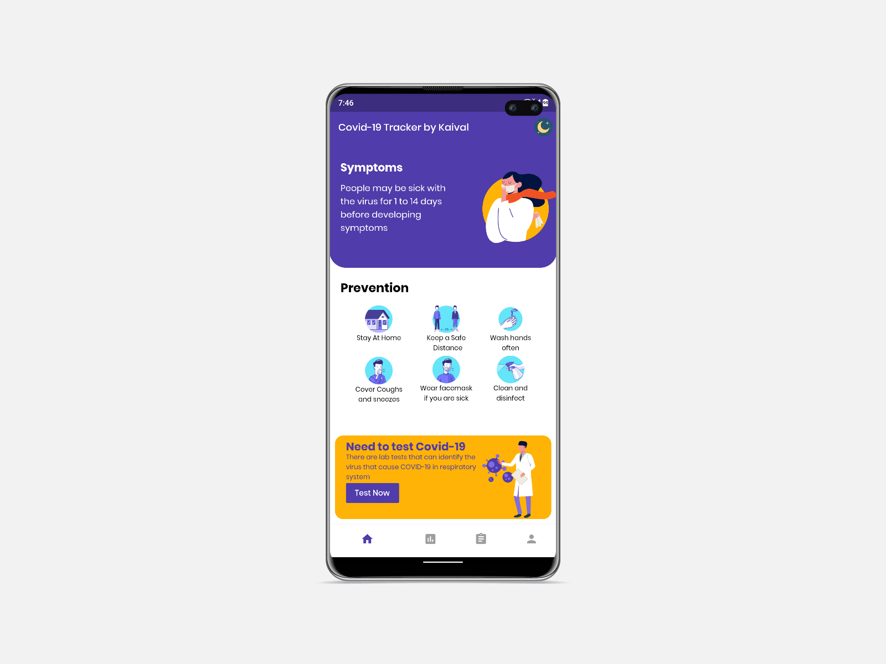

# Covid Tracker by Kaival Patel

This app shows the corona data of India with features like helpline numbers and call them with Every states corona status.In addition to this it also shows the global data of corona.

Developed in Flutter.

## Getting Started

I would like to appreciate work of the following people and community at the start.

### API DISTRIBUTION

  GLOBAL DATA FECTH =&gt; <a href="https://coronavirus-19-api.herokuapp.com/all" rel="nofollow">Global Data Api</a> 
  INDIAN DATA FETCH =&gt; <a href="https://api.rootnet.in/covid19-in/stats/latest" rel="nofollow">covid19India</a> 
  <a href="https://www.covid19india.org/" rel="nofollow">AWESOME CORONA TRACKER WEBSITE A BIG HATSOFF TO WORK</a> 
   

### UI Used in this App

Show Some love  
  <a href="https://www.uplabs.com/posts/covid-19-e9c787fc-2d76-47e5-8b43-e3e5c68bfe5e" rel="nofollow">COVID-19 UI by Ram Lakhan on        Uplabs.com</a>

App Consist of four Parts

<ol type="numbers">
  <li>Home (Symptoms and Prevention)</li>
  <li>Statistics (India and Global data with Graph of past 7 days of India)</li>
  <li>Reports (Donation to PM Cares Fund and Statistics of All the States of India</li>
  <li>About Developer (About me Section with Social buttons to follow me and links to my Github REPO)</li>
</ol>
 

<h5>Lets get this Party Started :)</h5>

 

<h5> ☀️ 🌜 Dark Mode is Also Implemented in the App </h5>
Lets have a Look!!!😠

<!--Home-->
<table>
  <tr>
    <td><b><a target="_blank" href="ss/img/homelight.png">☀️Home☀️</a></b></td>
    <td><b><a target="_blank" href="ss/img/homedark.png">🌜Home🌜</a></b></td>
  </tr>
  <tr>
    <td></td>
    <td></td>
   
  </tr>
</table>
  
<!--Stats-->
<table>
  <tr>
    <td><b><a target="_blank" href="ss/img/statslight.png">☀️Statistics☀️</a></b></td>
    <td><b><a target="_blank" href="ss/img/statsdark.png">🌜Statistics🌜</a></b></td>
  </tr>
  <tr>
    <td></td>
    <td></td>
   
  </tr>
</table>

  
<!--Report-->
<table>
  <tr>
    <td><b><a target="_blank" href="ss/img/reportlight.png">☀️Reports☀️</a></b></td>
    <td><b><a target="_blank" href="ss/img/reportdark.png">🌜Reports🌜</a></b></td>
  </tr>
  <tr>
    <td></td>
    <td></td>
   
  </tr>
</table>
   
<h5>🐬Lets see the Working of the App 🎥</h5>
 
 
<table>
  <tr>
    <td><b><a target="_blank" href="ss/img/homegif.gif">⚡️Home⚡️</a></b></td>
  </tr>
  <tr>
    <td></td>
  </tr>
</table>

  
<table>
  <tr>
    <td><b><a target="_blank" href="ss/gif/stats.gif">❄️Statistics❄️</a></b></td>
  </tr>
  <tr>
    <td></td>
  </tr>
</table>

